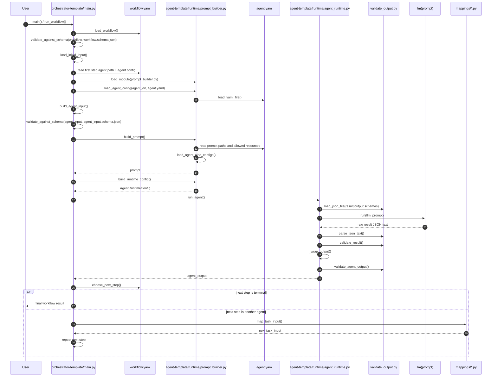
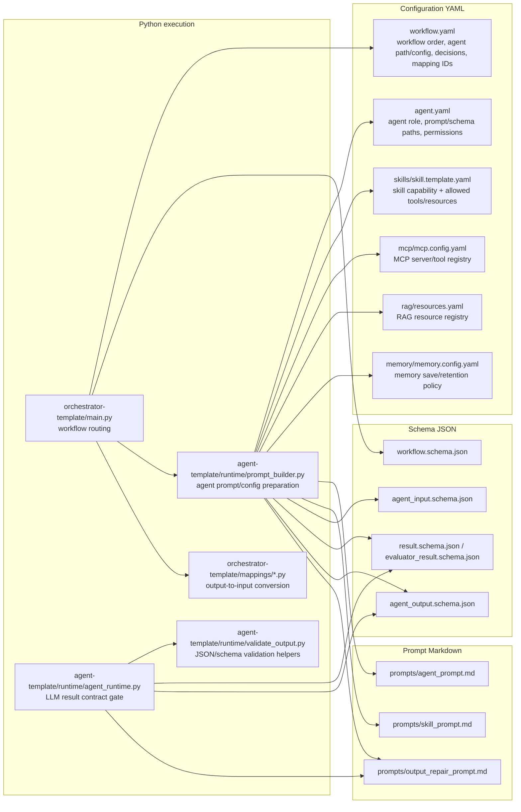
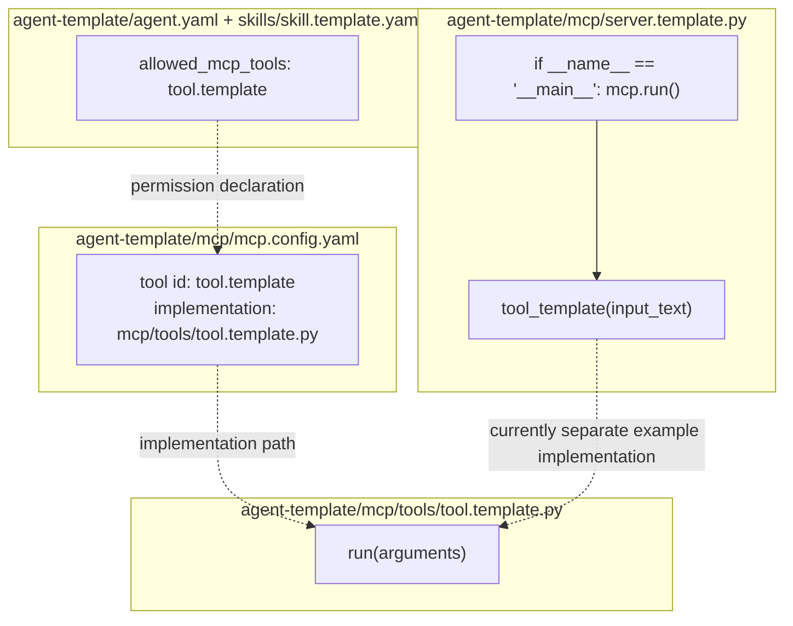

# MAAS Function Connection Graph

This document shows how the current template files connect at function level.

Legend:

- Solid arrow: implemented call or implemented file read.
- Dotted arrow: runtime data flow or external dependency.
- `*.yaml` files provide configuration.
- `*.schema.json` files validate structure.
- `*.md` prompt files become part of the LLM prompt.

## End-To-End Function Graph

```mermaid
flowchart TD
  CLI["CLI call<br/>python orchestrator-template/main.py --dry-run"]

  subgraph MainPy["orchestrator-template/main.py"]
    main_fn["main()"]
    load_workflow_fn["load_workflow(workflow_path)"]
    load_yaml_main["load_yaml_file(path)"]
    load_json_main["load_json_file(path)"]
    validate_schema_main["validate_against_schema(instance, schema_path)"]
    load_initial_input_fn["load_initial_input(workflow_dir, workflow, input_override)"]
    prepare_agent_fn["prepare_agent_invocation(workflow_dir, step, task_input)"]
    load_module_fn["load_module(module_path, module_name)"]
    build_agent_input_fn["build_agent_input(step, task_input)"]
    normalize_agent_type_fn["normalize_agent_type(workflow_role)"]
    run_agent_fn["run_agent(prepared, llm)"]
    run_workflow_fn["run_workflow(workflow_path, initial_input, llm)"]
    find_step_fn["find_step(workflow, step_id)"]
    choose_next_step_fn["choose_next_step(current_step, agent_output)"]
    get_transition_mapping_fn["get_transition_mapping(current_step, agent_output)"]
    get_step_input_mapping_fn["get_step_input_mapping(next_step)"]
    map_task_input_fn["map_task_input(workflow_dir, mapping_config, previous_agent_output, next_step, workflow_state)"]
  end

  subgraph WorkflowFiles["orchestrator-template config/files"]
    workflow_yaml["workflow.yaml"]
    workflow_schema["schemas/workflow.schema.json"]
    initial_input["inputs/example_input.json<br/>or --input file"]
    mapping_default_file["mappings/default_mapping.py"]
    mapping_eval_file["mappings/agent2_to_evaluator.py"]
    mapping_feedback_file["mappings/evaluator_feedback_to_agent_input.py"]
  end

  subgraph PromptBuilderPy["agent-template/runtime/prompt_builder.py"]
    pb_load_agent_config["load_agent_config(agent_dir, config_name)"]
    pb_load_yaml["load_yaml_file(path)"]
    pb_read_text["read_text_file(path)"]
    pb_resolve["resolve_agent_file(agent_dir, relative_path)"]
    pb_load_skills["load_skill_manifests(agent_dir, agent_config)"]
    pb_load_side_configs["load_agent_side_configs(agent_dir, agent_config)"]
    pb_build_prompt["build_prompt(agent_dir, agent_input, agent_config)"]
    pb_build_runtime_config["build_runtime_config(agent_dir, parent_workflow_step_id, agent_config, agent_type_override)"]
  end

  subgraph AgentFiles["agent-template config/prompt/schema files"]
    agent_yaml["agent.yaml"]
    agent_prompt_md["prompts/agent_prompt.md"]
    skill_prompt_md["prompts/skill_prompt.md"]
    skill_yaml["skills/skill.template.yaml"]
    mcp_yaml["mcp/mcp.config.yaml"]
    rag_yaml["rag/resources.yaml"]
    memory_yaml["memory/memory.config.yaml"]
    agent_input_schema["schemas/agent_input.schema.json"]
    result_schema["schemas/result.schema.json"]
    evaluator_result_schema["schemas/evaluator_result.schema.json"]
    agent_output_schema["schemas/agent_output.schema.json"]
    repair_prompt_md["prompts/output_repair_prompt.md"]
  end

  subgraph AgentRuntimePy["agent-template/runtime/agent_runtime.py"]
    runtime_config_cls["AgentRuntimeConfig"]
    runtime_init["AgentRuntime.__init__(config)"]
    runtime_run["AgentRuntime.run(llm, prompt)"]
    runtime_parse_validate["_parse_and_validate_result(raw_text)"]
    runtime_valid["_valid_output(result, status)"]
    runtime_invalid["_invalid_output(errors)"]
    runtime_failed["_failed_output(errors)"]
    runtime_wrap["_wrap_output(...)"]
    runtime_repair_prompt["_build_repair_prompt(previous_output, errors)"]
  end

  subgraph ValidateOutputPy["agent-template/runtime/validate_output.py"]
    vo_load_json["load_json_file(path)"]
    vo_parse_json["parse_json_text(raw_text)"]
    vo_validate_schema["validate_against_schema(instance, schema)"]
    vo_validate_result["validate_result(result, result_schema)"]
    vo_validate_agent_output["validate_agent_output(agent_output, agent_output_schema)"]
  end

  subgraph MappingPy["orchestrator-template/mappings/*.py"]
    default_map["default_mapping.map_input(...)"]
    eval_map["agent2_to_evaluator.map_input(...)"]
    feedback_map["evaluator_feedback_to_agent_input.map_input(...)"]
  end

  LLM["External LLM callable<br/>llm(prompt) -> raw JSON text"]
  FinalOutput["Final workflow output<br/>terminal step + last agent output"]

  CLI --> main_fn
  main_fn --> load_workflow_fn
  load_workflow_fn --> load_yaml_main
  load_yaml_main --> workflow_yaml
  load_workflow_fn --> validate_schema_main
  validate_schema_main --> load_json_main
  load_json_main --> workflow_schema

  main_fn --> load_initial_input_fn
  load_initial_input_fn --> initial_input
  load_initial_input_fn --> load_json_main

  main_fn --> prepare_agent_fn
  prepare_agent_fn --> workflow_yaml
  prepare_agent_fn --> load_module_fn
  load_module_fn --> pb_load_agent_config
  prepare_agent_fn --> pb_load_agent_config
  pb_load_agent_config --> pb_load_yaml
  pb_load_yaml --> agent_yaml

  prepare_agent_fn --> build_agent_input_fn
  build_agent_input_fn --> workflow_yaml
  build_agent_input_fn -. "agent_input dict" .-> agent_input_schema
  prepare_agent_fn --> validate_schema_main
  validate_schema_main --> agent_input_schema

  prepare_agent_fn --> normalize_agent_type_fn
  prepare_agent_fn --> pb_build_prompt
  pb_build_prompt --> pb_resolve
  pb_build_prompt --> pb_read_text
  pb_read_text --> agent_prompt_md
  pb_build_prompt --> pb_load_side_configs
  pb_load_side_configs --> pb_load_yaml
  pb_load_side_configs --> pb_load_skills
  pb_load_skills --> pb_load_yaml
  pb_load_yaml --> skill_yaml
  pb_load_yaml --> mcp_yaml
  pb_load_yaml --> rag_yaml
  pb_load_yaml --> memory_yaml
  pb_build_prompt -. "final prompt text" .-> LLM

  prepare_agent_fn --> pb_build_runtime_config
  pb_build_runtime_config --> pb_resolve
  pb_build_runtime_config --> runtime_config_cls
  pb_build_runtime_config --> result_schema
  pb_build_runtime_config --> evaluator_result_schema
  pb_build_runtime_config --> agent_output_schema
  pb_build_runtime_config --> repair_prompt_md

  main_fn -. "--dry-run prints prompt" .-> pb_build_prompt

  run_workflow_fn --> load_workflow_fn
  run_workflow_fn --> prepare_agent_fn
  run_workflow_fn --> run_agent_fn
  run_agent_fn --> load_module_fn
  load_module_fn --> runtime_init
  run_agent_fn --> runtime_run

  runtime_init --> vo_load_json
  vo_load_json --> result_schema
  vo_load_json --> evaluator_result_schema
  vo_load_json --> agent_output_schema
  runtime_init --> repair_prompt_md

  runtime_run --> LLM
  LLM -. "raw JSON text" .-> runtime_run
  runtime_run --> runtime_parse_validate
  runtime_parse_validate --> vo_parse_json
  runtime_parse_validate --> vo_validate_result
  vo_validate_result --> vo_validate_schema

  runtime_run --> runtime_repair_prompt
  runtime_repair_prompt --> repair_prompt_md
  runtime_repair_prompt -. "repair prompt" .-> LLM

  runtime_run --> runtime_valid
  runtime_run --> runtime_invalid
  runtime_run --> runtime_failed
  runtime_valid --> runtime_wrap
  runtime_invalid --> runtime_wrap
  runtime_failed --> runtime_wrap
  runtime_valid --> vo_validate_agent_output
  runtime_invalid --> vo_validate_agent_output
  vo_validate_agent_output --> vo_validate_schema

  run_workflow_fn --> choose_next_step_fn
  choose_next_step_fn --> workflow_yaml
  run_workflow_fn --> find_step_fn
  find_step_fn --> workflow_yaml
  run_workflow_fn --> get_transition_mapping_fn
  get_transition_mapping_fn --> workflow_yaml
  run_workflow_fn --> get_step_input_mapping_fn
  get_step_input_mapping_fn --> workflow_yaml
  run_workflow_fn --> map_task_input_fn

  map_task_input_fn --> load_module_fn
  load_module_fn --> default_map
  load_module_fn --> eval_map
  load_module_fn --> feedback_map
  default_map --> mapping_default_file
  eval_map --> mapping_eval_file
  feedback_map --> mapping_feedback_file
  map_task_input_fn -. "next task_input" .-> build_agent_input_fn

  choose_next_step_fn -. "terminal step" .-> FinalOutput
```

## Runtime Sequence

This is the same chain as a sequence diagram.

## File Role Map

## Optional MCP Template Functions

The MCP files are not yet called by `main.py`. They are templates for future
tool execution after an agent or skill decides to use an allowed tool.

